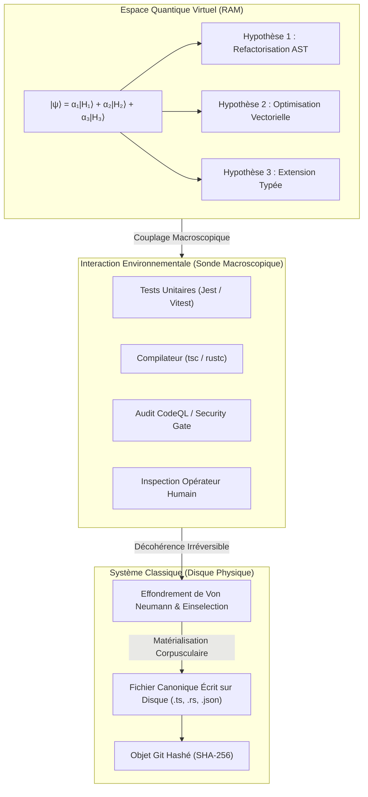

# Quantum VFS — Pilier 7 : La Décohérence Quantique & Cristallisation Physique

## 1. Fondement Physique : Le Problème de la Mesure et la Décohérence de Zurek

En mécanique quantique, un système isolé peut évoluer continûment selon l'équation de Schrödinger dans une superposition linéaire infinie d'états purs :
$$|\psi\rangle = \sum_{i} \alpha_i |S_i\rangle$$

Cependant, à notre échelle macroscopique, nous n'observons jamais un chat à la fois mort et vivant (paradoxe du chat de Schrödinger). La théorie moderne de la **décohérence quantique** (formulée par Wojciech Zurek, H. Dieter Zeh et confirmée par Serge Haroche) explique pourquoi :
- Un système n'est jamais parfaitement isolé de son environnement.
- Les myriades d'interactions microscopiques avec les photons thermiques et les molécules d'air environnantes entraînent une fuite irréversible de la cohérence de phase vers l'environnement.
- Les termes d'interférence non diagonaux de la matrice densité $\rho_{ij} \, (i \neq j)$ s'annulent de manière exponentielle en un temps infinitésimal $\tau_D \ll 10^{-20}\,\text{s}$.
- La superposition se réduit à un mélange statistique classique diagonal (**einselection** ou sélection induite par l'environnement), où un seul état propre observable survit à la mesure macroscopique.

---

## 2. Transposition Informatique dans GenOS (Quantum VFS)

Dans les architectures classiques d'agents de code, chaque modification spéculative est immédiatement écrite sur le disque dur physique. Cela engendre :
1. Une usure massive des I/O disque.
2. Des verrous de fichiers concurrents (file locks / deadlocks).
3. Des déclenchements intempestifs de watchers de développement (hot-reload, TypeScript server, ESLint).
4. Des commits ou états intermédiaires corrompus polluant le workspace.

Le moteur de **Décohérence Quantique** (`QuantumDecoherenceEngine`) résout ces écueils :
- **Tant que le système reste en phase cohérente**, les agents génèrent, superposent, intriquent et testent virtuellement leurs mutations de code en pure mémoire vive (RAM) à vitesse ultra-rapide.
- **Dès qu'un observable macroscopique interagit** (ex: commande `npm test`, compilation `cargo build`, validation de sécurité CI, ou commit final de l'opérateur), la fonction d'onde s'effondre de façon déterministe vers l'état propre optimal.
- Le fichier virtuel subit une **cristallisation corpusculaire** instantanée et est persisté sur le système de fichiers physique classique.

---

## 3. Les Observables Macroscopiques (`ObservableTrigger`)

| Déclencheur | Type d'Interaction | Conséquence sur le Quantum VFS |
| :--- | :--- | :--- |
| `UNIT_TEST_EXECUTION` | Exécution des suites de validation | Effondre la superposition vers l'état satisfaisant tous les tests |
| `COMPILER_BUILD` | Invocation du compilateur (`tsc`, `rustc`) | Matérialise les fichiers typés et vérifie l'absence d'erreurs |
| `OPERATOR_INSPECTION` | Diff ou affichage demandé par l'humain | Fournit une vue classique nette sans superposition indécise |
| `SECURITY_GATE` | Analyseur statique / CodeQL | Cristallise et gèle l'état pour certification de sécurité |
| `PERSISTENCE_FLUSH` | Clôture de tâche autonome ou commit | Écrit définitivement les fichiers sur le stockage persistant |

---

## 4. Cycle de Vie Orchestré

1. **Stage Quantique (`stageQuantumFile`)** : Inscription du fichier avec ses états propres concurrents et calcul d'amplitudes normalisées.
2. **Intrication Multi-Fichiers (`entanglement`)** : Synchronisation non-locale des contrats d'interfaces et des suites de tests associées.
3. **Pénétration par Effet Tunnel (`tunnelingWriter`)** : Écritures concurrentes sans blocage via couches d'ombre quantiques.
4. **Régulation d'Incertitude (`heisenbergGuard`)** : Ajustement continu entre vélocité d'émission et profondeur d'audit.
5. **Décohérence & Cristallisation (`triggerDecoherence`)** :
   - Sélection de l'état propre gagnant selon la stratégie (`highest_probability`, `highest_fitness`, ou `ground_state`).
   - Réconciliation et coalescence des couches d'ombres tunnelisées.
   - Écriture atomique et intègre sur le disque physique.
