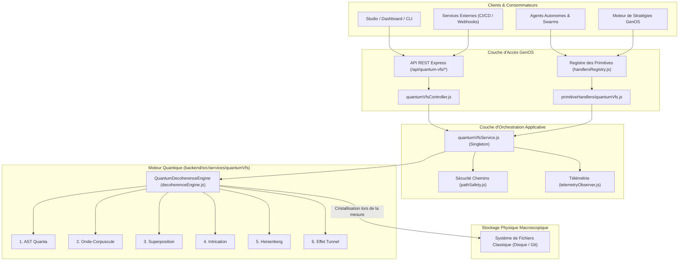

# Quantum VFS — Branchement et Intégration dans GenOS

Ce document détaille l'interconnexion complète du **Quantum VFS** (les 7 piliers de la mécanique quantique) avec l'infrastructure globale de **GenOS** :
1. Le service applicatif singleton `quantumVfsService.js`.
2. L'API REST Express (`/api/quantum-vfs/*`) montée dans `app.js`.
3. Le registre des primitives de stratégie d'agents (`handlersRegistry.js`).

---

## 1. Schéma d'Architecture du Branchement Global



---

## 2. API REST Express (`/api/quantum-vfs`)

Montée directement dans [`backend/src/app.js`](file:///c:/Users/Shadow/Documents/GitHub/GenOS/backend/src/app.js) sous le préfixe `/api/quantum-vfs` :

| Méthode | Endpoint | Description | Paramètres Principaux |
| :--- | :--- | :--- | :--- |
| `POST` | `/api/quantum-vfs/stage` | Place un fichier virtuel en phase cohérente quantique | `workspaceId`, `filePath`, `content`, `options` |
| `POST` | `/api/quantum-vfs/superpose` | Ajoute une hypothèse spéculative alternative | `workspaceId`, `filePath`, `label`, `content`, `weight`, `metadata` |
| `POST` | `/api/quantum-vfs/entangle` | Intrique deux fichiers sous un invariant non-local | `workspaceId`, `pathA`, `pathB`, `mode`, `rules` |
| `POST` | `/api/quantum-vfs/tunnel-write` | Écriture traversant un verrou par effet tunnel | `workspaceId`, `filePath`, `content`, `agentEnergy` |
| `POST` | `/api/quantum-vfs/decoherence` | Déclenche l'effondrement et la cristallisation sur disque | `workspaceId`, `trigger`, `options` |
| `GET` | `/api/quantum-vfs/metrics` | Fournit les métriques de cohérence, Bell et Heisenberg | `workspaceId` |
| `POST` | `/api/quantum-vfs/reset` | Réinitialise l'espace de cohérence d'un workspace | `workspaceId` |

---

## 3. Primitives de Stratégie d'Agents (`HANDLERS`)

Les agents et workflows GenOS peuvent exécuter des mutations de fichiers quantiques directement via les primitives déclaratives du registre [`handlersRegistry.js`](file:///c:/Users/Shadow/Documents/GitHub/GenOS/backend/src/services/primitiveHandlers/handlersRegistry.js) :

```javascript
// Exemple d'appel direct depuis une stratégie d'agent :
const result = await HANDLERS.quantum_vfs_superpose({
  workspaceId: 'workspace_alpha',
  filePath: 'src/services/auth.ts',
  label: 'jwt_v2_migration',
  content: 'export function verify() { /* implementation v2 */ }',
  weight: 4.5
});

// Déclenchement de la décohérence lors du passage au test unitaire
await HANDLERS.quantum_vfs_decohere({
  workspaceId: 'workspace_alpha',
  trigger: 'UNIT_TEST_EXECUTION',
  writeToDisk: true
});
```

---

## 4. Sécurité et Confinement des Chemins

Tous les chemins de fichiers transmis à `quantumVfsService` transitent obligatoirement par `normalizeRelativePath` ([`pathSafety.js`](file:///c:/Users/Shadow/Documents/GitHub/GenOS/backend/src/services/pathSafety.js)) :
- Interdiction absolue des traversées de répertoires (`../`).
- Confinement strict à la racine du workspace.
- Rejet des chemins absolus ou préfixés par des racines système (`/`, `C:\`).
