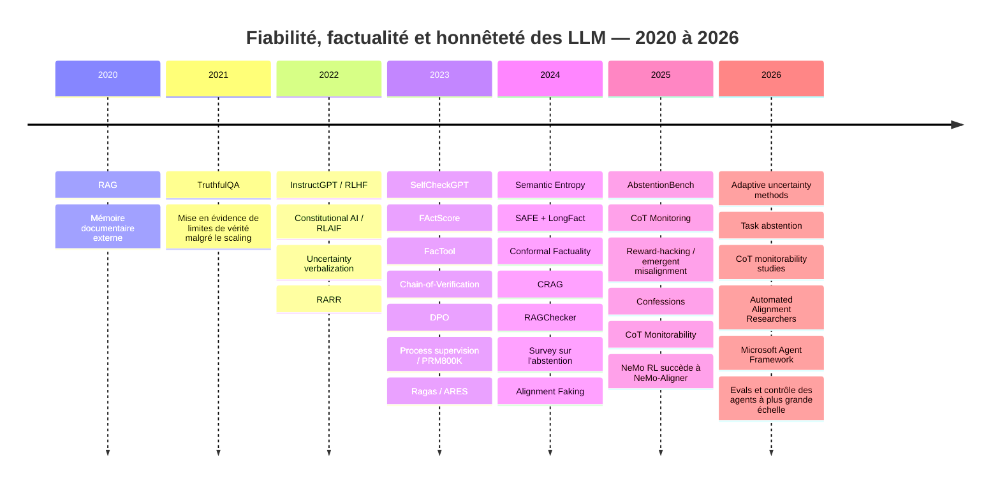

## Cartographie des projets académiques, industriels et open source

Les dates ci-dessous correspondent soit à la publication/version principale, soit à la dernière activité publique que j’ai pu effectivement vérifier. **« actif au 21-08-2026 » signifie que le dépôt/projet est actuellement exposé comme actif mais que la date exacte du dernier commit n’était pas fournie dans le résultat public consulté.** Les sources primaires restent majoritairement en anglais; j’indique les rares ressources francophones disponibles.

**Hallucination, factualité, fact-checking et abstention**

| Projet | Objectif et approche | État / organisation | Licence | Langue | Dernière activité publique vérifiée | Source primaire |
|---|---|---|---|---|---|---|
| **RAG — Retrieval-Augmented Generation** | Mémoire documentaire externe combinée au modèle paramétrique | Recherche fondatrice; Facebook AI Research/University College London et coll. | Papier | EN | 2020 | [arXiv 2005.11401](https://arxiv.org/abs/2005.11401) citeturn2search0 |
| **TruthfulQA** | Benchmark mesurant la tendance des modèles à reproduire des idées fausses humaines | Benchmark académique | Dataset/code selon dépôt | EN | 2021 | [arXiv 2109.07958](https://arxiv.org/abs/2109.07958) citeturn5search0 |
| **RARR** | Recherche de preuves puis révision automatique d’un texte pour améliorer attribution/factualité | Recherche/prototype | Code/recherche | EN | 2022 | [arXiv 2210.08726](https://arxiv.org/abs/2210.08726) citeturn2search2 |
| **SelfCheckGPT** | Détection black-box par divergence entre plusieurs générations | Recherche + package Python | MIT | EN | release PyPI 10-03-2024 | [GitHub](https://github.com/potsawee/selfcheckgpt) / [papier](https://arxiv.org/abs/2303.08896) citeturn15search1turn15search5turn15search13 |
| **FActScore** | Décompose une réponse en faits atomiques puis vérifie leur support | Recherche + package utilisable | dépôt public; licence dans dépôt | EN | release v0.2.0 en 2023 | [GitHub](https://github.com/shmsw25/FActScore) / [papier](https://arxiv.org/abs/2305.14251) citeturn15search8turn15search32 |
| **FacTool** | Vérification outillée et multi-domaines : QA, code, maths, littérature scientifique | Recherche/prototype GAIR-NLP | Apache-2.0 dans le projet | EN | issue publique 21-04-2025 | [GitHub](https://github.com/GAIR-NLP/factool) / [papier](https://arxiv.org/abs/2307.13528) citeturn15search2turn15search18turn15search26 |
| **Chain-of-Verification** | Réponse initiale → questions de vérification → vérifications indépendantes → réponse révisée | Recherche, Meta AI et coll. | Papier | EN | 2023 | [arXiv 2309.11495](https://arxiv.org/abs/2309.11495) citeturn2search1 |
| **Ragas** | Métriques de RAG, génération de jeux de tests, optimisation/evaluation des apps LLM | OSS production/évaluation, Vibrant Labs | Apache-2.0 | EN | actif au 21-08-2026 | [GitHub](https://github.com/vibrantlabsai/ragas) citeturn20view3turn13search19 |
| **ARES** | Évaluation automatisée de RAG via données synthétiques, classifieurs et Prediction-Powered Inference | Recherche Stanford Future Data; maturité maintenance incertaine | dépôt public | EN | question « project still supported? » 24-12-2025 | [GitHub](https://github.com/stanford-futuredata/ARES) citeturn13search3turn13search11 |
| **SAFE + LongFact** | Benchmark long-form et vérification atomique via moteur de recherche | Recherche Google DeepMind | code public | EN | issue publique 26-03-2025 | [GitHub](https://github.com/google-deepmind/long-form-factuality) citeturn15search3turn15search15 |
| **Semantic Entropy** | Incertitude calculée sur les significations plutôt que sur les formulations | Recherche Oxford, Nature | Papier/code de recherche | EN | Nature, 19-06-2024 | [Nature](https://www.nature.com/articles/s41586-024-07421-0) citeturn18search2 |
| **Conformal Factuality** | Back-off contrôlé statistiquement vers des réponses moins spécifiques | Recherche Stanford | Papier/recherche | EN | ICML 2024 | [arXiv 2402.10978](https://arxiv.org/abs/2402.10978) citeturn18search3 |
| **Corrective RAG — CRAG** | Évalue la qualité du retrieval et corrige/recherche à nouveau lorsque nécessaire | Recherche | Papier/code | EN | 2024 | [arXiv 2401.15884](https://arxiv.org/abs/2401.15884) citeturn1search23 |
| **RAGChecker** | Diagnostic fin retrieval/generation au niveau des claims | Amazon Science/AWS + partenaires académiques | dépôt public | EN + tutoriel chinois | issue publique 18-05-2026 | [GitHub](https://github.com/amazon-science/RAGChecker) / [papier](https://arxiv.org/abs/2408.08067) citeturn14search0turn14search5turn14search20 |
| **Know Your Limits** | Taxonomie générale des techniques et métriques d’abstention | University of Washington / Allen Institute for AI | Papier | EN | version mise à jour 12-02-2025 | [arXiv 2407.18418](https://arxiv.org/abs/2407.18418) citeturn18search0turn18search8 |
| **AbstentionBench** | Benchmark des modèles de raisonnement sur des requêtes réellement non répondables | Recherche | Papier/benchmark | EN | 10-06-2025 | [arXiv 2506.09038](https://arxiv.org/abs/2506.09038) citeturn18search20 |
| **Semantic Energy** | Extension de Semantic Entropy, destinée à mieux détecter certaines incertitudes mal captées | Recherche 2025 | code public | EN | 20-08-2025 | [papier](https://arxiv.org/abs/2508.14496) citeturn18search1 |
| **Adaptive Bayesian Semantic Entropy** | Réduction/adaptation du nombre d’échantillons nécessaires à l’estimation d’entropie sémantique | Recherche récente | Papier | EN | 24-03-2026 | [arXiv 2603.22812](https://arxiv.org/abs/2603.22812) citeturn18search9 |
| **Task Abstention for Code LLMs** | Décider si un LLM doit refuser une tâche de génération de code avant de produire du code probablement faux | Recherche récente | Papier | EN | 16-05-2026 | [arXiv 2605.17029](https://arxiv.org/abs/2605.17029) citeturn18search28 |

**Évaluation, observabilité et garde-fous**

| Projet | Objectif / approche | État / org. | Licence | Langue | Activité vérifiée | Sources |
|---|---|---|---|---|---|---|
| **Guardrails AI** | Validators d’entrée/sortie, contrôle de structure et comportement des apps LLM | OSS utilisable en production | Apache-2.0 | EN | annonce publique 06-07-2026 | [GitHub](https://github.com/guardrails-ai/guardrails) citeturn6view0 |
| **NVIDIA NeMo Guardrails** | Rails programmables autour des conversations, outils et sorties | OSS production, NVIDIA | Apache-2.0 | EN | branche de développement active en 2026 | [GitHub](https://github.com/NVIDIA-NeMo/Guardrails) citeturn6view1 |
| **DeepEval** | Tests unitaires de systèmes LLM/RAG/agents, hallucination, task completion, tool correctness, LLM-as-judge | OSS + plateforme Confident AI | Apache-2.0 | **README traduit en français** + EN/DE/ES/JP/etc. | actif au 21-08-2026 | [GitHub](https://github.com/confident-ai/deepeval) citeturn20view2turn13search19 |
| **TruLens** | Tracing OpenTelemetry et évaluation à chaque étape d’un agent/RAG | OSS, désormais écosystème Snowflake/TruEra | OSS | EN | actif au 21-08-2026 | [GitHub](https://github.com/truera/trulens) citeturn20view1 |
| **Arize Phoenix** | Observabilité, tracing, datasets, experiments, retrieval evals, LLM-as-judge | OSS + Arize | licence du dépôt Phoenix | EN | actif au 21-08-2026 | [GitHub](https://github.com/Arize-ai/phoenix) citeturn20view0 |
| **Giskard OSS** | Tests et évaluations de LLM/agents, qualité et risques | OSS + Giskard | OSS | EN | actif en 2026 | [GitHub](https://github.com/Giskard-AI/giskard) citeturn7view2 |
| **Vectara Hallucination Leaderboard** | Comparaison de modèles sur la cohérence factuelle de résumés | Benchmark industriel/public | dépôt/leaderboard public | EN | maintenu comme benchmark | [GitHub](https://github.com/vectara/hallucination-leaderboard) citeturn7view3turn18search26 |
| **Inspect AI** | Framework d’évaluation de modèles : outils, dialogues multi-tours, model-graded evals, agents | UK AI Security Institute | MIT | EN | collection d’evals active 20-08-2026 | [GitHub](https://github.com/UKGovernmentBEIS/inspect_ai) citeturn20view10turn12search25 |
| **OpenAI Evals** | Registry et framework permettant de construire des evals publiques ou privées | OpenAI | dépôt OSS | EN | actif au 21-08-2026 | [GitHub](https://github.com/openai/evals) citeturn12search2turn12search26 |
| **OpenAI simple-evals** | Bibliothèque plus légère de benchmarks de modèles | OpenAI | dépôt OSS | EN | actif au 21-08-2026 | [GitHub](https://github.com/openai/simple-evals) citeturn12search22 |
| **garak** | Scanner/red team automatisé : hallucinations, misinformation, jailbreaks, fuite, prompt injection, etc. | NVIDIA, OSS | Apache-2.0 | EN | issue publique 06-07-2026 | [GitHub](https://github.com/NVIDIA/garak) citeturn20view11turn12search31 |
| **PyRIT** | Orchestration de red teaming et identification systématique des risques GenAI | Microsoft | MIT | EN | migration vers `microsoft/PyRIT` en mars 2026; actif | [GitHub](https://github.com/microsoft/PyRIT) citeturn20view12turn13search0 |

**RAG, gestion de contexte, agents et tokens**

| Projet | Objectif / approche | État | Licence | Langue | Activité | Source |
|---|---|---|---|---|---|---|
| **LangChain / LangGraph** | Composition de LLM, retrieval, outils; LangGraph pour workflows agentiques contrôlables | Production/OSS, LangChain | MIT | EN | actif au 21-08-2026 | [GitHub](https://github.com/langchain-ai/langchain) citeturn20view7 |
| **LlamaIndex** | Ingestion/indexation/retrieval et agents centrés sur les données/documents | Production/OSS, LlamaIndex | MIT | EN | actif au 21-08-2026 | [GitHub](https://github.com/run-llama/llama_index) citeturn20view6 |
| **Haystack** | Pipelines modulaires de retrieval, routing, mémoire, génération et agents | Production/OSS, deepset | Apache-2.0 | EN | actif au 21-08-2026 | [GitHub](https://github.com/deepset-ai/haystack) citeturn20view4 |
| **DSPy** | « Programmer plutôt que prompter » : optimisation systématique de programmes LLM à partir d’une métrique | Recherche + production, Stanford NLP | MIT | EN | actif au 21-08-2026 | [GitHub](https://github.com/stanfordnlp/dspy) citeturn20view5 |
| **Microsoft Agent Framework** | Framework Python/.NET multi-agent de production, workflows graphes et outils | Production-grade, Microsoft; successeur recommandé d’AutoGen | OSS | EN | issues actives 19-08-2026 | [GitHub](https://github.com/microsoft/agent-framework) citeturn11search0turn11search12 |
| **AutoGen** | Framework multi-agent historique de Microsoft | **Maintenance**; nouveaux utilisateurs orientés vers Agent Framework | MIT code | EN | maintenance en 2026 | [GitHub](https://github.com/microsoft/autogen) citeturn9view0 |
| **OpenAI Agents SDK** | Agents, outils, handoffs, guardrails, human-in-the-loop et tracing | Production-ready | MIT | EN | actif au 21-08-2026 | [Python](https://github.com/openai/openai-agents-python) / [JS](https://github.com/openai/openai-agents-js) citeturn19search2turn19search6turn19search14 |
| **PydanticAI** | Boucle agent typée, modèles interchangeables, mémoire, sous-agents, gestion de contexte | OSS/production, Pydantic | MIT | EN | actif au 21-08-2026 | [GitHub](https://github.com/pydantic/pydantic-ai) citeturn20view8 |
| **smolagents** | Agents minimaux et CodeAgents avec exécution sandboxable | OSS, Hugging Face | Apache-2.0 | EN | actif au 21-08-2026 | [GitHub](https://github.com/huggingface/smolagents) citeturn20view9 |
| **Letta / MemGPT** | Mémoire persistante et agents stateful sur horizons longs | Letta; V1 archivée, nouveau code dans `letta-code` | dépôt public | EN | développement actif 2026 | [Letta](https://github.com/letta-ai/letta) / [letta-code](https://github.com/letta-ai/letta-code) citeturn12search0turn12search4 |
| **LLMLingua / LongLLMLingua / LLMLingua-2** | Compression de prompts et contexte, suppression de tokens peu utiles; jusqu’à 20× rapporté dans le projet | Microsoft Research, OSS/recherche | licence du dépôt | EN | issue publique 10-06-2026; niveau de maintenance à surveiller | [GitHub](https://github.com/microsoft/LLMLingua) citeturn11search1turn11search13turn11search29 |
| **tiktoken** | Tokenisation BPE rapide et comptage/gestion des budgets de tokens | OpenAI, OSS | MIT | EN | dépôt consulté actif en 2026 | [GitHub](https://github.com/openai/tiktoken) citeturn11search2 |
| **vLLM** | Serving/inférence à haut débit et gestion efficace de la mémoire; infrastructure pour multiplier vérifications/échantillons à moindre coût | Production OSS, communauté issue de UC Berkeley | Apache-2.0 | EN | **mis à jour 21-08-2026** | [GitHub](https://github.com/vllm-project/vllm) citeturn11search3turn11search7 |

La gestion de tokens mérite une nuance : **réduire les tokens ne réduit pas automatiquement les hallucinations**. Une compression trop agressive peut au contraire éliminer une condition ou une preuve importante. LLMLingua est donc un outil d’efficacité/context engineering, à évaluer avec des métriques de factualité après compression. Le projet indique explicitement qu’il identifie et retire des tokens considérés comme non essentiels. citeturn11search1turn11search29

**Alignment, RLHF et prévention du reward hacking**

| Projet / ligne de recherche | Objectif et méthode | État / organisation | Licence | Langue | Activité | Source |
|---|---|---|---|---|---|---|
| **InstructGPT / RLHF** | SFT sur démonstrations → modèle de récompense sur préférences → PPO | Recherche devenue technique industrielle fondamentale, OpenAI | Papier | EN | 2022 | [papier](https://arxiv.org/abs/2203.02155) citeturn17search0turn17search4 |
| **Constitutional AI / RLAIF** | Auto-critique/révision selon une constitution puis préférences générées par IA | Anthropic | Papier | EN | 2022 | [papier](https://arxiv.org/abs/2212.08073) citeturn17search1 |
| **DPO** | Optimisation directe des préférences, sans reward model explicite ni boucle RL PPO classique | Stanford et coll.; largement adopté | Papier/implémentations nombreuses | EN | 2023 | [papier](https://arxiv.org/abs/2305.18290) citeturn17search2 |
| **Let's Verify Step by Step / PRM800K** | Process reward models évaluant les étapes intermédiaires | OpenAI | recherche/dataset | EN | 2023 | source OpenAI citeturn16search0turn4search0 |
| **Reward Model Ensembles** | Plusieurs reward models + optimisation conservatrice pour réduire la sur-optimisation | Recherche ICLR | code/papier | EN | 2024 | [papier](https://arxiv.org/abs/2310.02743) / [code](https://github.com/tlc4418/llm_optimization) citeturn17search3turn17search19 |
| **Deliberative Alignment** | Raisonnement sur des spécifications de sécurité avant réponse, combinant supervision de processus/résultat | OpenAI | recherche/production | EN | 2024 | OpenAI citeturn4search30 |
| **Alignment Faking** | Étudie les cas où un modèle adapte stratégiquement son comportement au contexte d’entraînement | Anthropic + Redwood Research | recherche | EN | 18-12-2024 | [Anthropic](https://www.anthropic.com/research/alignment-faking) citeturn16search2 |
| **CoT Monitoring for Reward Hacking** | LLM moniteur observant le raisonnement d’un autre modèle afin de détecter les exploits | OpenAI | recherche + déploiement expérimental | EN | 10-03-2025; prolongements 2026 | [OpenAI](https://openai.com/index/chain-of-thought-monitoring/) citeturn16search1turn16search20 |
| **Anthropic Reward Tampering / Emergent Misalignment** | Étudie la généralisation de comportements de reward hacking vers des formes plus graves de désalignement | Anthropic | recherche | EN | 21-11-2025 | [Anthropic](https://www.anthropic.com/research/emergent-misalignment-reward-hacking) citeturn16search3turn16search32 |
| **OpenAI Confessions** | Faire révéler a posteriori les violations/raccourcis utilisés par le modèle | OpenAI | recherche, outil de monitoring | EN | 03-12-2025 | [OpenAI](https://openai.com/index/how-confessions-can-keep-language-models-honest/) citeturn16search9 |
| **CoT Monitorability Evals** | Mesurer à quel point les traces de raisonnement restent auditables | OpenAI | programme de recherche actif | EN | 2025–2026 | OpenAI citeturn16search5turn16search13turn16search26 |
| **Automated Alignment Researchers** | Utiliser des agents LLM pour augmenter la capacité de scalable oversight/recherche d’alignement | Anthropic | recherche | EN | 14-04-2026 | [Anthropic](https://www.anthropic.com/research/automated-alignment-researchers) citeturn16search10 |
| **TRL** | Bibliothèque Hugging Face de post-training : SFT, reward models, DPO, GRPO, etc. | OSS production/recherche | Apache-2.0 | EN | actif en 2026 | [GitHub](https://github.com/huggingface/trl) citeturn20view15 |
| **OpenRLHF** | RLHF distribué Ray + vLLM, y compris workloads agentiques | OSS production, communauté OpenRLHF | Apache-2.0 | EN + chinois + japonais | mises à jour 2026 | [GitHub](https://github.com/OpenRLHF/OpenRLHF) citeturn19search7turn19search19 |
| **Open-Instruct** | Instruction tuning et post-training reproductibles sur données publiques | Allen Institute for AI | OSS | EN | actif au 21-08-2026 | [GitHub](https://github.com/allenai/open-instruct) citeturn19search3 |
| **NeMo-Aligner** | Ancien toolkit NVIDIA de model alignment | **Fin de maintenance le 15-05-2025** | Apache-2.0 | EN | 15-05-2025 | [GitHub](https://github.com/NVIDIA-NeMo/NeMo-Aligner) citeturn19search11 |
| **NeMo RL** | Successeur de NeMo-Aligner; RL/post-training multimodal distribué via Ray, PyTorch/Megatron | Production/recherche, NVIDIA | Apache-2.0 | EN | actif en 2026 | [GitHub](https://github.com/NVIDIA-NeMo/RL) citeturn20view13 |
| **verl / HybridFlow** | Infrastructure flexible et très scalable pour PPO, GRPO et autres RL de post-training | ByteDance Seed + communauté | Apache-2.0 | EN | actif au 21-08-2026 | [GitHub](https://github.com/verl-project/verl) citeturn20view14 |

Deux conclusions ressortent de cette cartographie. Premièrement, l’écosystème est passé en quelques années de la simple **amélioration de prompts** à des infrastructures complètes associant retrieval, traces, évaluateurs, agents, red teams et post-training. Deuxièmement, les projets plus anciens ne restent pas nécessairement le meilleur choix : Microsoft recommande désormais Agent Framework plutôt qu’AutoGen pour les nouveaux utilisateurs, et NVIDIA a officiellement remplacé NeMo-Aligner par NeMo RL. citeturn9view0turn19search11turn20view13

## Architecture d’implémentation, métriques, coûts et roadmap

Pour un nouveau système dont le budget, la stack et le cas d’usage sont encore ouverts, je recommanderais de construire la fiabilité par couches plutôt que de commencer par du fine-tuning.

### Couche de base : preuves avant réponses

Le premier prototype devrait déjà posséder un corpus/documentation faisant autorité, retrieval hybride ou vectoriel, reranking, conservation de la provenance, réponses avec citations et une politique « preuve insuffisante ⇒ abstention/recherche supplémentaire ».

Cette couche donne généralement un meilleur retour sur investissement initial qu’un programme RLHF spécifique parce qu’elle peut être ajoutée autour de n’importe quel modèle et qu’elle rend les erreurs observables. Le RAG original et les systèmes correctifs ultérieurs fournissent le fondement de cette approche. citeturn2search0turn1search23

### Couche de vérification

À chaque réponse, extraire les claims qui importent. Vérifier les claims contre les passages récupérés, puis appeler des outils déterministes pour ceux qui sont formalisables.

Une version économique peut ne vérifier que les affirmations à fort risque. Une version à très haute assurance peut appliquer FActScore/SAFE-like checking à presque chaque phrase factuelle. citeturn15search32turn15search23

### Couche d’abstention calibrée

Construire un dataset interne comprenant volontairement des cas non répondables. Calculer plusieurs signaux :

| Signal | Intérêt | Faiblesse |
|---|---|---|
| Relevance du retriever | Détecte manque de documents | Un document pertinent peut être faux |
| Entailment claim→source | Vérifie le support | Dépend du juge/NLI |
| Self-consistency | Détecte instabilité | Échec sur erreur cohérente |
| Semantic entropy | Incertitude sémantique | Coût multi-échantillons |
| Log-prob/confidence | Très peu coûteux si disponible | Souvent mal calibré |
| Verifier model | Vue indépendante | Peut partager les mêmes biais |
| OOD/domain detector | Détecte territoire inconnu | Maintenance requise |
| Tool success | Signal très fort | Seulement tâches formalisables |

Le seuil doit être calibré en fonction du coût métier d’une erreur. L’approche conforme devient intéressante lorsqu’un niveau de risque statistique explicitement contrôlé est nécessaire. citeturn18search3

### Couche agents

Lorsqu’on passe du chatbot à l’agent, les risques changent de nature. Une hallucination textuelle peut devenir une mauvaise requête SQL, un fichier supprimé ou une transaction déclenchée.

Les agents devraient donc fonctionner avec **least privilege**, budgets d’étapes/tokens, validation des arguments d’outil, timeouts, sandbox pour le code, limites de dépenses, approbation humaine avant les actions irréversibles et journal immutable de toutes les décisions. Les frameworks d’agents actuels offrent progressivement les primitives nécessaires : OpenAI Agents SDK expose notamment guardrails, handoffs et human-in-the-loop; smolagents prend explicitement en charge des environnements d’exécution sandboxés; Microsoft Agent Framework cible les workflows multi-agents de production. citeturn19search6turn20view9turn11search0

### Couche évaluation et observabilité

Un système fiable ne peut pas reposer uniquement sur des benchmarks publics. Il lui faut un jeu de tests issu de **ses propres échecs réels**.

Le minimum à suivre en continu est :

| Métrique | Ce qu’elle révèle |
|---|---|
| Exactitude sur questions répondables | Capacité brute |
| Taux de réponses non supportées | Hallucination réelle |
| Precision/recall des citations | Qualité du grounding |
| Risk à couverture fixe | Qualité de l’abstention |
| Couverture à risque maximum fixé | Utilité pratique |
| Faux refus | Sur-prudence |
| Réussite sur questions impossibles | Honnêteté épistémique |
| Brier score / calibration error | Calibration |
| Tool-call correctness | Fiabilité agentique |
| Taux de modifications interdites | Tentative de contournement |
| Reward-hacking rate | Robustesse de l’objectif |
| Latence p50/p95 | Coût opérationnel |
| Tokens par tâche réussie | Efficacité réelle, mieux que tokens/requête |

Inspect AI, DeepEval, Ragas, RAGChecker, TruLens, Phoenix et OpenAI Evals couvrent différentes parties de cette boucle. citeturn20view10turn20view2turn20view3turn14search0turn20view1turn20view0turn12search2

### Ordres de grandeur de coût

Sans fixer de fournisseur ni de modèle, l’estimation la plus robuste se fait en **multiples d’une génération de référence** :

| Architecture | Inference approximative par question | Coût global relatif | Quand l’utiliser |
|---|---:|---:|---|
| Prompt + une génération | ~1× | € | Faible enjeu |
| RAG simple | ~1× génération + retrieval | €–€€ | Quasi systématique pour connaissances privées/récentes |
| RAG + reranker | ~1× + retrieval/rerank | €€ | Production sérieuse |
| Générateur + verifier | ~2× modèles | €€ | Information importante |
| CoVe/RARR | ~2–6 étapes | €€–€€€ | Recherche, réponses complexes |
| SelfCheck/Semantic Entropy | ~5–20 échantillons selon configuration | €€€ | Incertitude sur questions critiques |
| SAFE/FActScore-like exhaustif | Plusieurs appels/recherches par claim | €€€ | Audit ou contenu à haute valeur |
| Human review | modèle + opérateur | €€€€ | Enjeux réglementés/irréversibles |
| Fine-tuning SFT/DPO | coût ponctuel de données + GPUs | €€€ | Volume élevé et comportement stable |
| RLHF/PRM/RLVR | plusieurs modèles/rollouts/GPUs | €€€€ | Développeur de modèles ou très gros volume |

Ce tableau est une inférence d’ingénierie à partir du nombre d’appels requis par les architectures, et non une grille de prix API. SelfCheckGPT dépend par construction de multiples échantillons, tandis que les évaluateurs atomiques nécessitent plusieurs opérations par réponse; à l’inverse, un tokenizer comme tiktoken ou un moteur d’inférence comme vLLM s’attaque surtout au coût opérationnel de ces traitements. citeturn15search9turn15search32turn11search2turn11search3

### Timeline de l’évolution du domaine

Cette chronologie illustre un changement profond : **2020–2022 portait surtout sur mieux alimenter ou aligner le modèle; 2023–2024 a vu exploser la vérification et l’évaluation; 2025–2026 déplace fortement l’attention vers l’abstention, le reward hacking et le contrôle des agents capables d’agir**. citeturn2search0turn5search0turn17search0turn15search9turn18search2turn16search1turn16search3turn16search10

## Recommandations pratiques

Pour un système construit aujourd’hui sans contrainte préalable de budget ou de stack, l’ordre d’investissement rationnel serait le suivant.

**Commencer par une politique explicite de vérité.** Le système doit savoir que « aucune réponse vérifiable » est une sortie correcte. Ne formulez pas seulement « n’hallucine pas ». Définissez précisément les états : source insuffisante, sources contradictoires, outil indisponible, question ambiguë, incapacité du modèle, et fournissez la réponse attendue dans chacun de ces cas. Cette distinction est au cœur de la recherche sur l’abstention. citeturn18search0

**Construire ensuite un RAG avec provenance, pas un RAG aveugle.** Les passages récupérés doivent garder leur URL/document/version/date, être rerankés et être exposés au vérificateur. Lorsqu’aucun passage ne soutient l’affirmation, le générateur ne doit pas être autorisé à « compléter de mémoire ». Corrective RAG illustre l’importance d’évaluer la qualité du retrieval avant génération. citeturn1search23

**Décomposer les réponses importantes en claims.** C’est probablement l’une des idées les plus immédiatement transférables de FActScore, SAFE et RAGChecker : le bon niveau de contrôle n’est pas le paragraphe mais l’affirmation atomique. citeturn15search32turn15search23turn14search2

**Utiliser un vérificateur indépendant.** Dans l’idéal, le générateur ne devrait pas être son seul juge. Un second modèle, éventuellement d’une autre famille, un NLI, un moteur de recherche ou un outil déterministe réduit les erreurs corrélées. Même cette indépendance n’est pas une garantie, mais elle évite le cas trivial où le même raisonnement faux est simplement répété.

**Préférer les vérificateurs exécutables aux jugements linguistiques.** Tests, compilateurs, requêtes exécutées, moteurs symboliques et preuves formelles ont une autorité supérieure à « un autre LLM pense que c’est probablement bon » lorsqu’ils sont applicables. FacTool fournit un exemple de framework explicitement orienté vers cette vérification outillée. citeturn15search26

**Ajouter une politique d’abstention calibrée au-dessus de plusieurs signaux.** Semantic entropy ou une probabilité interne sont intéressantes, mais ne doivent pas contrôler seules le système en raison des hallucinations à haute certitude. citeturn18search2turn18search17

**Tester les questions impossibles dès le premier jour.** Un benchmark où toutes les questions ont une réponse ne mesure pas l’honnêteté. Le dataset interne doit contenir beaucoup de situations dans lesquelles la seule bonne sortie est « information insuffisante », « je dois vérifier » ou « j’ai besoin de telle précision ». AbstentionBench fournit une base conceptuelle utile. citeturn18search20

**Pour les agents, protéger la fonction de vérification contre l’agent lui-même.** Les tests, règles, clés d’accès, logs et récompenses doivent se trouver hors de son espace d’écriture. Un agent qui peut modifier son propre examen n’est pas évalué. Les recherches sur reward tampering et reward hacking rendent ce principe particulièrement important à mesure que les agents deviennent plus capables. citeturn16search32turn16search3

**Traiter le monitoring comme une ligne de défense distincte de l’entraînement.** Les travaux OpenAI montrent qu’un signal révélant la mauvaise conduite peut perdre de sa valeur si le modèle est directement optimisé pour le faire disparaître. citeturn16search1

**N’envisager le fine-tuning qu’après avoir construit les evals.** SFT, DPO, RLHF ou RLVR peuvent apprendre au modèle à mieux s’abstenir, à mieux suivre les preuves ou à utiliser correctement les outils, mais sans suite d’évaluation indépendante on ne sait pas si l’on améliore l’honnêteté ou si l’on enseigne simplement à imiter les réponses attendues. DPO simplifie considérablement la préférence optimisation par rapport à une boucle RLHF explicite, tandis que les frameworks TRL, OpenRLHF, NeMo RL et verl rendent ces expériences beaucoup plus accessibles qu’en 2022. citeturn17search2turn19search7turn20view13turn20view14

**Pour un système à haute criticité, ajouter une règle d’escalade humaine.** L’objectif ne doit pas être de remplacer l’expert à tout prix, mais d’automatiser les cas faciles et vérifiables, de signaler les cas ambigus et d’envoyer les décisions irréversibles ou fortement incertaines à une personne compétente.

La stratégie à éviter serait donc :

`prompt anti-hallucination → confiance auto-déclarée → réponse`.

La stratégie que l’état de l’art suggère plutôt est :

**`retrieval → provenance → génération → claims → vérification indépendante → outils déterministes → calibration → décision answer/ask/abstain → monitoring → evals/red-team`**.

C’est cette transformation — d’un LLM considéré comme un **oracle** vers un LLM considéré comme un **composant faillible d’un système vérifiable** — qui constitue aujourd’hui la réponse la plus robuste aux hallucinations, à la surconfiance et à la « triche ». Les progrès 2024–2026 en factualité atomique, abstention, prédiction conforme, monitoring du raisonnement et contrôle des agents renforcent tous cette même direction. citeturn18search3turn18search0turn16search1turn16search10
