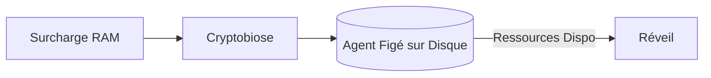
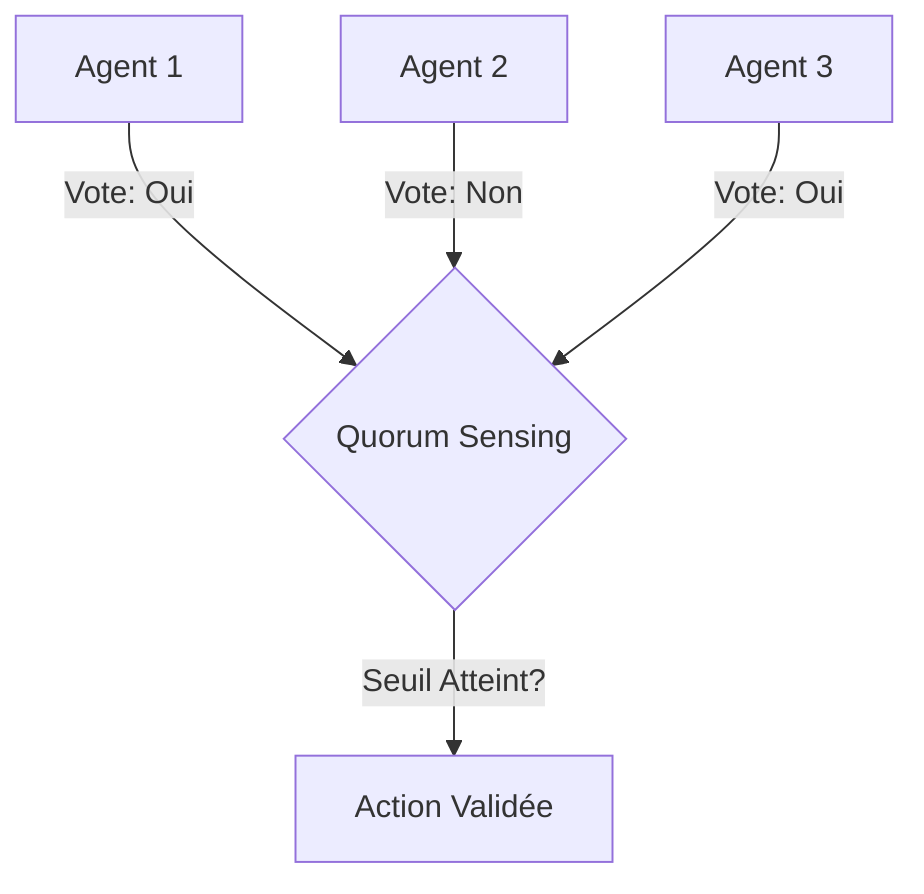

# Documentation des Tests Backend : Routeur Cognitif & Essaim Griot (Swarm)

Ce document recense la suite des tests biomimétiques et d'architecture situés dans le dossier `backend/`, avec un focus particulier sur la gestion cognitive et l'écologie des agents (modèles locaux exclusifs).

---

## 1. Test du Routeur Cognitif (Sélection et Isolation)

**Lien vers le test** : [backend/test_cognitive_router.js](file:///c:/Users/Shadow/Documents/GitHub/GenOS/backend/test_cognitive_router.js)  
**Cible** : `src/services/modelRouter.js`

### Explication du test
Valide le fonctionnement du Routeur Cognitif, le composant central qui analyse la complexité d'une tâche (faible, moyenne, haute) et choisit automatiquement le LLM local (Ollama, LM Studio, vLLM) le plus adapté pour l'Agent Griot, sans jamais faire appel au Cloud (OpenAI, Anthropic).

### Problèmes ciblés
* **Fuite de données (Data Privacy)** : Garantir une étanchéité totale des données grâce aux modèles locaux.
* **Gaspillage de ressources de calcul** : Utiliser un petit modèle (faible latence) pour une tâche simple et réserver le grand modèle pour les tâches complexes.

### Résultats
Pour chaque niveau de complexité, le test vérifie que le routeur identifie et invoque le bon modèle local avec succès, et gère correctement les timeouts (fixés à 120s) pour éviter les blocages du thread.

### Étapes du test
1. Lancement d'une boucle sur les complexités `['low', 'medium', 'high']`.
2. Appel du routeur avec un prompt basique ("Say exactly OK").
3. Vérification de la réponse et du modèle sélectionné par le routeur.
4. Catch d'éventuelles erreurs (modèle indisponible, timeout).

### Base Mathématique et Scientifique
**Biologie** : Le triage cognitif s'apparente au système nerveux autonome vs système nerveux central. Un réflexe (tâche 'low') est géré localement par la moelle épinière (petit modèle) pour la rapidité, tandis qu'une réflexion complexe ('high') est envoyée au cortex préfrontal (grand modèle).  
**Mathématiques** : Fonction de classification $f: \mathcal{T} \to \mathcal{M}$ où $\mathcal{T}$ est l'espace des tâches (estimé par entropie ou mots-clés) et $\mathcal{M}$ l'ensemble des modèles locaux disponibles.

### Schéma
```mermaid
graph TD
    A[Nouvelle Tâche Griot] --> B{Routeur Cognitif}
    B -- Complexité Low --> C[Modèle Local Léger (Llama 3 8B)]
    B -- Complexité Medium --> D[Modèle Local Moyen (Mistral 7B)]
    B -- Complexité High --> E[Modèle Local Lourd (Command R+ / Mixtral)]
    C -.-> F[Exécution Sécurisée]
    D -.-> F
    E -.-> F
```

---

## 2. Test Biologie Griot (Cryptobiose et Barrière Hémato-Encéphalique)

**Lien vers le test** : [backend/test_griot_biology.js](file:///c:/Users/Shadow/Documents/GitHub/GenOS/backend/test_griot_biology.js)  
**Cible** : `mcpExecutor.js` (Outils `genos_resilience_cryptobiosis` et `genos_biomimicry_cellular_bbb`)

### Explication du test
Ce test s'assure que les agents Griot peuvent déclencher des états métaboliques de survie. La **Cryptobiose** permet de figer un agent (sauvegarde de son état exact) pour libérer de la RAM. La **Barrière Hémato-Encéphalique (BBB)** filtre les entrées malveillantes vers le noyau de l'agent.

### Problèmes ciblés
* **Crashs Mémoire (OOM)** : Figer des agents en attente permet d'éviter l'épuisement des ressources système.
* **Prompt Injection / Empoisonnement** : Filtrer le contexte qui atteint les instructions système.

### Base Mathématique et Scientifique
**Biologie** : 
1. *Cryptobiose* : État de métabolisme quasi-nul chez les tardigrades permettant de survivre à des conditions extrêmes. 
2. *Barrière Hémato-Encéphalique* : Cellules endothéliales bloquant les toxines du sang vers le cerveau.

### Schéma


---

## 3. Test de l'Essaim Griot (Swarm & Quorum)

**Lien vers le test** : [backend/test_griot_swarm.js](file:///c:/Users/Shadow/Documents/GitHub/GenOS/backend/test_griot_swarm.js)  
**Cible** : `src/services/mcpBioTools.js` (Outils de type `flocking_explore` et `network_quorum`)

### Explication du test
Teste la dynamique d'essaim multi-agents (Swarm). Les agents s'alignent dans leur exploration du code (Flocking) et prennent des décisions destructives uniquement s'ils atteignent un consensus majoritaire (Quorum). L'Agent de Télémétrie observe l'essaim silencieusement.

### Problèmes ciblés
* **Actions destructives unilatérales** : Un agent ne peut pas supprimer un fichier critique seul.
* **Exploration redondante** : Évite que plusieurs agents analysent les mêmes fichiers.

### Étapes du test
1. Appel de l'outil `genos_biomimicry_network_quorum` avec un seuil de quorum à 5 pour l'action `refactor_auth`.
2. Appel de l'outil `genos_biomimicry_flocking_explore` sur la zone `api_layer` avec une force d'alignement.
3. Vérification de l'exécution correcte des sous-processus via mock de `child_process`.

### Base Mathématique et Scientifique
**Biologie** : Le "Quorum Sensing" chez les bactéries permet de déclencher une attaque synchronisée uniquement quand la densité de population est suffisante. Le "Flocking" simule les murmures d'étourneaux (modèle de Boids de Craig Reynolds : alignement, cohésion, séparation).  
**Mathématiques** : Automates cellulaires et Algorithmes d'optimisation par essaim particulaire (PSO).

### Schéma


---

## 4. Test du Réseau Mycélien (Griot Mycelium)

**Lien vers le test** : [backend/test_griot_mycelium.js](file:///c:/Users/Shadow/Documents/GitHub/GenOS/backend/test_griot_mycelium.js)  

### Explication du test
Valide le réseau de communication souterrain (hors contexte LLM principal) entre les agents Griot, similaire aux réseaux mycorhiziens. Permet de partager silencieusement les caches, l'état de l'arbre syntaxique, et les erreurs détectées, minimisant le trafic sur les prompts.
