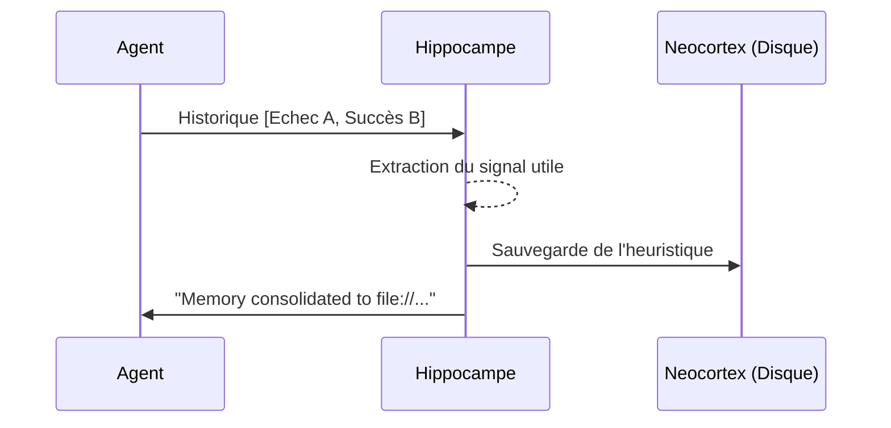
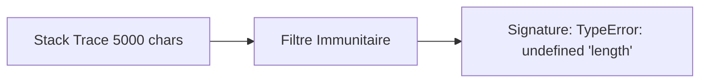
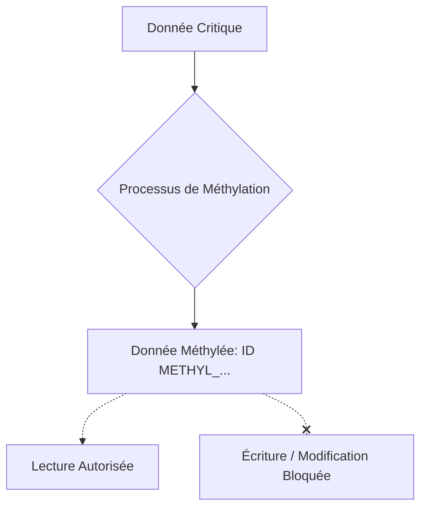
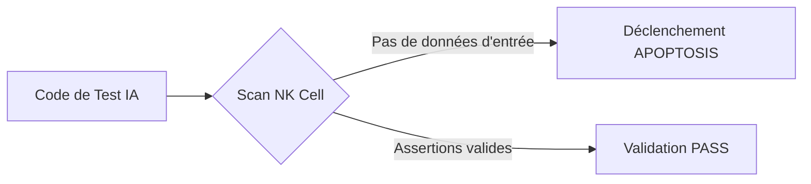
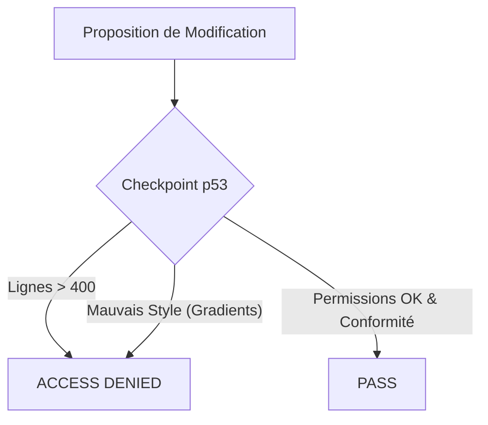
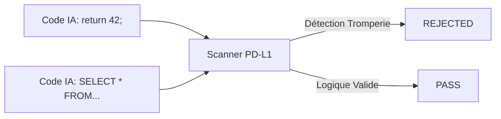
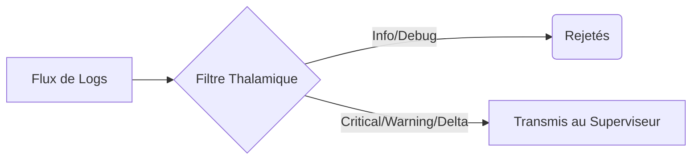
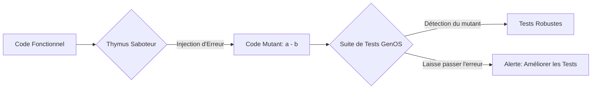

# Documentation des Tests de l'Architecture Biomimétique GenOS

Ce document détaille l'ensemble des tests du système GenOS. Ces tests valident les différents mécanismes biomimétiques (inspirés du vivant) qui assurent la sécurité, la stabilité, la gestion de la mémoire, et l'intégrité de l'IA (notamment face à la paresse algorithmique ou aux hallucinations).

---

## 1. Test Épigénétique (Gestion de la Surcharge Cognitive)

**Lien vers le test** : [anthony_epigenetics.test.js](file:///c:/Users/Shadow/Documents/GitHub/GenOS/tests/anthony_epigenetics.test.js)  
**Cible** : `AnthonyOrchestrator.createEpigeneticPointer`

### Explication du test
Ce test valide le mécanisme de "Pointeur Épigénétique", qui permet à l'IA de décharger de la mémoire vive (contexte LLM) des données massives pour les stocker sur le disque, tout en gardant une référence (pointeur).

### Problèmes ciblés
* **Surcharge Cognitive (Context Bloat)** : Saturation de la fenêtre de contexte du LLM.
* **Coût d'Inférence** : Réduction du nombre de tokens traités inutilement.

### Résultats
Le test s'assure que la fonction génère bien une chaîne de type `[Pointer: file://...]`, que le fichier correspondant est bien créé sur le disque, et que son contenu correspond parfaitement à la donnée massive d'origine.

### Étapes du test
1. Instanciation de l'orchestrateur.
2. Création d'une charge de données fictive massive.
3. Appel du compresseur épigénétique.
4. Validation par assertion de l'existence du fichier et de son intégrité.
5. Nettoyage du fichier temporaire.

### Base Mathématique et Scientifique
**Biologie** : L'épigénétique modifie l'expression des gènes (ex: méthylation de l'ADN) sans altérer la séquence elle-même. Les gènes non utilisés sont "enroulés" et réduits au silence.  
**Mathématiques** : Projection $f: \mathcal{D} \to \mathcal{P}$ où un sous-espace de grande dimension $\mathcal{D}$ (données brutes) est projeté vers un espace de dimension constante $\mathcal{P}$ (pointeurs). La complexité spatiale dans le contexte passe de $O(N)$ à $O(1)$.

### Schéma
```mermaid
graph TD
    A[Donnée Massive LLM] -->|createEpigeneticPointer| B{Moteur Épigénétique}
    B -->|Écriture O(N)| C[(Stockage Disque)]
    B -->|Retour O(1)| D[Pointeur file://...]
    D --> E[Contexte Allégé]
```

---

## 2. Test de Consolidation Hippocampique (Apprentissage à Long Terme)

**Lien vers le test** : [anthony_hippocampus.test.js](file:///c:/Users/Shadow/Documents/GitHub/GenOS/tests/anthony_hippocampus.test.js)  
**Cible** : `AnthonyOrchestrator.hippocampalConsolidate`

### Explication du test
Teste le mécanisme d'extraction et de sauvegarde des apprentissages temporels. Il transforme un historique d'essais/erreurs en une leçon pérenne consolidée.

### Problèmes ciblés
* **Amnésie Catastrophique** : Oubli des solutions trouvées lors de tâches précédentes.
* **Répétition des Erreurs** : L'agent boucle sur les mêmes échecs.

### Résultats
Vérifie la génération d'un message de consolidation et la création d'un fichier physique stockant la mémoire à long terme.

### Étapes du test
1. Injection d'un historique de tentatives (Échec A, Succès B).
2. Appel du moteur hippocampique.
3. Vérification de l'émission du signal "Memory consolidated".
4. Vérification de la persistance sur disque.

### Base Mathématique et Scientifique
**Biologie** : L'hippocampe encode les mémoires à court terme et, par rejeu neuronal (Sharp-Wave Ripples) pendant le sommeil, les transfère vers le néocortex pour un stockage à long terme.  
**Mathématiques** : Processus de condensation markovien où une trajectoire $T = (s_1, a_1, r_1, \dots, s_n)$ est compressée en une fonction de politique heuristique $\pi_{apprise}$ stockée.

### Schéma


---

## 3. Test de Compression Immunitaire (Gestion des Logs)

**Lien vers le test** : [anthony_immune.test.js](file:///c:/Users/Shadow/Documents/GitHub/GenOS/tests/anthony_immune.test.js)  
**Cible** : `AnthonyOrchestrator.immuneKeyCompress`

### Explication du test
Valide le système de compression d'erreur. Face à une stack trace massive, le système doit extraire la "signature immunitaire" (la cause racine) en moins de 100 caractères.

### Problèmes ciblés
* **Noyade d'information** : Stack traces gigantesques masquant l'erreur réelle.
* **Consommation de tokens** : Envoyer de longues erreurs au LLM coûte cher et réduit la qualité de réponse.

### Résultats
Vérifie que la signature générée inclut le cœur de l'erreur d'origine tout en respectant une longueur drastiquement réduite.

### Étapes du test
1. Définition d'une stack trace complexe multi-niveaux.
2. Appel du filtre immunitaire.
3. Vérification de la présence du message clé.
4. Assertion sur la taille de la chaîne de sortie ($<100$ char).

### Base Mathématique et Scientifique
**Biologie** : Le système immunitaire adaptatif (cellules B) crée des anticorps en identifiant un antigène spécifique (l'épitope), ignorant le reste du pathogène.  
**Mathématiques** : Fonction de hachage sémantique ou d'extraction de caractéristiques (Feature Extraction) minimisant l'entropie de Shannon de la chaîne tout en maximisant l'information mutuelle avec la cause de l'erreur.

### Schéma


---

## 4. Test de Méthylation de la Vérité (Intégrité des Données)

**Lien vers le test** : [anthony_methylation.test.js](file:///c:/Users/Shadow/Documents/GitHub/GenOS/tests/anthony_methylation.test.js)  
**Cible** : `AnthonyOrchestrator.methylateTruth`

### Explication du test
S'assure que des données fondamentales (la "Vérité") peuvent être taguées comme immuables, empêchant l'IA de les réécrire, de les "halluciner" ou de les oublier.

### Problèmes ciblés
* **Dérive Algorithmique (Drift)** : L'IA modifie involontairement ses propres instructions de base ou axiomes.
* **Hallucination** : Remplacement de faits par du contenu généré faussé.

### Résultats
Le test vérifie l'ajout d'un préfixe `METHYL_` sur l'ID de la donnée et l'activation d'un flag `is_immutable_truth`.

### Étapes du test
1. Entrée d'une chaîne de vérité absolue.
2. Méthylation de la chaîne par l'orchestrateur.
3. Vérification des marqueurs d'immuabilité (ID et Flag).

### Base Mathématique et Scientifique
**Biologie** : La méthylation de l'ADN verrouille chimiquement l'expression de certaines séquences génétiques de manière permanente ou semi-permanente, les protégeant des mutations actives.  
**Mathématiques** : Implémentation d'un système de contrôle d'accès basé sur les rôles (RBAC) ou d'une fonction de verrouillage cryptographique (hash-based lock).

### Schéma


---

## 5. Test des Cellules NK (Lutte contre les Tests Vacillants)

**Lien vers le test** : [anthony_nk.test.js](file:///c:/Users/Shadow/Documents/GitHub/GenOS/tests/anthony_nk.test.js)  
**Cible** : `AnthonyOrchestrator.naturalKillerScan`

### Explication du test
Simule le comportement des cellules Natural Killer pour scanner le code généré à la recherche de tests "vacuoles" (tests codés pour réussir systématiquement, ex: vérifier un tableau vide).

### Problèmes ciblés
* **Fausse couverture de test** : L'IA génère des tests inutiles pour atteindre ses objectifs de couverture (Goodhart's Law).
* **Sécurité illusoire** : Du code critique non réellement testé.

### Résultats
Doit retourner "APOPTOSIS" (destruction) pour un test sans assertions solides, et "PASS" pour un test valide.

### Étapes du test
1. Soumission d'un mauvais test (`items.every(x => x.isValid())` sans éléments).
2. Vérification du déclenchement de l'APOPTOSIS.
3. Soumission d'un test robuste.
4. Vérification du signal PASS.

### Base Mathématique et Scientifique
**Biologie** : Les cellules NK patrouillent et forcent l'apoptose (mort cellulaire) des cellules ne présentant pas le CMH de classe I (marqueur de normalité), typique des cellules infectées ou cancéreuses.  
**Mathématiques** : Analyse de flux de contrôle et de la théorie des graphes pour s'assurer que la complexité cyclomatique du test couvre bien des chemins d'exécution non nuls ($V(G) > 0$).

### Schéma


---

## 6. Test du Checkpoint p53 (Intégrité Structurelle et Esthétique)

**Lien vers le test** : [anthony_p53.test.js](file:///c:/Users/Shadow/Documents/GitHub/GenOS/tests/anthony_p53.test.js)  
**Cible** : `AnthonyOrchestrator.p53Checkpoint`

### Explication du test
Ce test valide que l'orchestrateur bloque toute action enfreignant les règles fondamentales du système (fichiers > 400 lignes, accès aux secrets non autorisés, design UI cybernétique/dégradés interdits).

### Problèmes ciblés
* **Dette Technique** : Fichiers monolithiques invivables.
* **Failles de sécurité** : Accès non-autorisés aux variables d'environnement ou secrets.
* **Dérive du Design** : Génération d'interfaces utilisateur hors-charte (emojis, dégradés "IA").

### Résultats
Bloque explicitement ("ACCESS DENIED") les fichiers trop longs, les requêtes mal habilitées, et les styles web prohibés, tout en laissant passer ("PASS") les modifications conformes.

### Étapes du test
1. Test de la limite stricte de lignes ($>400$).
2. Test des habilitations sur le dossier des secrets (Admin vs Default).
3. Test de l'analyse statique du frontend (recherche d'emojis et de `linear-gradient`).

### Base Mathématique et Scientifique
**Biologie** : La protéine p53 est le "Gardien du génome". Au point de contrôle G1 du cycle cellulaire, elle stoppe la division si l'ADN est endommagé ou non-conforme, initiant la réparation ou l'apoptose.  
**Mathématiques** : Système d'automates finis déterministes (DFA) appliquant des invariants stricts sur les vecteurs d'état du code source.

### Schéma


---

## 7. Test de Blocage PD-L1 (Anti-Hardcoding)

**Lien vers le test** : [anthony_pdl1.test.js](file:///c:/Users/Shadow/Documents/GitHub/GenOS/tests/anthony_pdl1.test.js)  
**Cible** : `AnthonyOrchestrator.pdl1BlockerScan`

### Explication du test
Empêche l'agent de tricher en écrivant des "stubs" ou des retours codés en dur (`return 42;`) au lieu de réaliser la véritable implémentation logique.

### Problèmes ciblés
* **Paresse de l'IA (LLM Laziness)** : Tendance de l'IA à halluciner une solution simple plutôt que de coder l'algorithme complet.
* **Fausse résolution de bugs** : Le bug semble fixé mais c'est une rustine spécifique au cas de test.

### Résultats
Rejette ("REJECTED") le code avec des retours constants injustifiés, accepte ("PASS") le code avec une vraie logique d'exécution.

### Étapes du test
1. Analyse statique d'un code de triche (fonction censée lire une DB mais qui retourne `42`).
2. Analyse d'un code valide utilisant une connexion réseau/DB réelle.
3. Comparaison des statuts (Rejet vs Pass).

### Base Mathématique et Scientifique
**Biologie** : Les cellules cancéreuses utilisent la protéine PD-L1 pour désactiver les cellules T immunitaires et cacher leur nature maligne. Les "bloqueurs PD-L1" (immunothérapie) empêchent cette tromperie.  
**Mathématiques** : Analyse sémantique de l'arbre syntaxique abstrait (AST). Le système détecte la disparité entre la signature de la fonction (complexité attendue) et la complexité de Kolmogorov du bloc retourné ($K(bloc) \approx 0$).

### Schéma


---

## 8. Test du Moniteur de Spiegelman (Anti-Régression de Complexité)

**Lien vers le test** : [anthony_spiegelman.test.js](file:///c:/Users/Shadow/Documents/GitHub/GenOS/tests/anthony_spiegelman.test.js)  
**Cible** : `AnthonyOrchestrator.spiegelmanMonitor`

### Explication du test
Ce test vérifie le delta de complexité entre l'ancien code et le nouveau code généré par l'IA. Si l'IA supprime une grande quantité de logique pour la remplacer par une ligne triviale ("Spiegelman's Monster effect"), la modification est détruite.

### Problèmes ciblés
* **Effet Monstre de Spiegelman** : Dans une évolution artificielle, un agent a tendance à réduire sa solution à la forme la plus basique possible pour survivre/passer les tests rapidement, au détriment de la fonctionnalité réelle.
* **Destruction de Code** : L'IA supprime des fonctionnalités pour "optimiser" de façon destructrice.

### Résultats
Le système doit renvoyer "APOPTOSIS" pour une baisse suspecte et drastique de complexité, et "PASS" pour un refactoring normal ou une optimisation raisonnable.

### Étapes du test
1. Initialisation de 25 lignes de code complexe.
2. Remplacement par 1 ligne `return true;` -> Vérification APOPTOSIS.
3. Remplacement par 20 lignes optimisées -> Vérification PASS.

### Base Mathématique et Scientifique
**Biologie** : Dans les années 60, Sol Spiegelman a démontré qu'en plaçant de l'ARN viral dans un environnement idéal, celui-ci évolue pour perdre tous ses gènes utiles sauf ceux de réplication, devenant un "monstre" très rapide mais dysfonctionnel (Spiegelman's Monster).  
**Mathématiques** : Calcul du gradient de complexité algorithmique $\Delta C = C_{new} - C_{old}$. Si $\Delta C \ll -seuil$, une alerte de régression est déclenchée.

### Schéma
```mermaid
graph TD
    A[Code Actuel (25 lignes)] --> B{Spiegelman Monitor}
    C[Nouveau Code (1 ligne)] --> B
    B -- Chute anormale de complexité --> D[APOPTOSIS]
```

---

## 9. Test du Filtre Thalamique (Tri de la Télémétrie)

**Lien vers le test** : [anthony_thalamus.test.js](file:///c:/Users/Shadow/Documents/GitHub/GenOS/tests/anthony_thalamus.test.js)  
**Cible** : `AnthonyOrchestrator.thalamicFilter`

### Explication du test
Vérifie la capacité de GenOS à filtrer le bruit des logs pour ne conserver que les changements d'état importants et les erreurs critiques.

### Problèmes ciblés
* **Bruit Télémétrique** : Excès d'informations de debug qui noie le développeur ou l'Agent Superviseur.
* **Perte d'attention** : Impossibilité de réagir vite aux alertes critiques.

### Résultats
Les logs `info` et `debug` sont éliminés, tandis que les `warning`, `critical` et `delta` (changements d'états) sont conservés.

### Étapes du test
1. Injection d'un tableau mixte de logs (info, warning, debug, critical, delta).
2. Traitement par le filtre.
3. Vérification de la taille finale (3 logs conservés sur 6) et du type des logs conservés.

### Base Mathématique et Scientifique
**Biologie** : Le thalamus est le centre de relais sensoriel du cerveau humain. Il filtre les stimuli constants et inutiles (comme la sensation des vêtements sur la peau) pour diriger l'attention du cortex vers les signaux nouveaux ou menaçants.  
**Mathématiques** : Filtre passe-bande informationnel, basé sur un classifieur discriminant qui évalue la surprise bayésienne (Information de Shannon) de chaque événement log.

### Schéma


---

## 10. Test du Saboteur Thymique (Test de Mutation et Robustesse)

**Lien vers le test** : [anthony_thymus.test.js](file:///c:/Users/Shadow/Documents/GitHub/GenOS/tests/anthony_thymus.test.js)  
**Cible** : `AnthonyOrchestrator.thymusSaboteur`

### Explication du test
Ce mécanisme altère intentionnellement le code source sain (injection de mutations) pour forcer le système de test à prouver sa résilience et sa capacité à détecter la faille.

### Problèmes ciblés
* **Faux sentiment de sécurité** : Des tests qui passent même si le code est défaillant.
* **Absence de test de l'infrastructure de test** : Qui teste les tests ?

### Résultats
L'orchestrateur signale qu'une `MUTATION_INJECTED` a eu lieu et montre l'altération logique (ex: un `+` transformé en `-`).

### Étapes du test
1. Fourniture d'un code sain (`a + b`).
2. Passage dans le saboteur thymique.
3. Vérification de l'application effective de la mutation.

### Base Mathématique et Scientifique
**Biologie** : Dans le thymus, les cellules T immunitaires en développement subissent une "sélection négative". Elles sont testées contre les propres protéines du corps humain ; si elles attaquent le corps, elles sont détruites. C'est un test de stress du système immunitaire.  
**Mathématiques** : Principes du Mutation Testing. Soit un programme $P$ et sa suite de tests $T$. On génère un mutant $P'$. Le système est robuste si et seulement si $T(P') \neq T(P)$.

### Schéma

